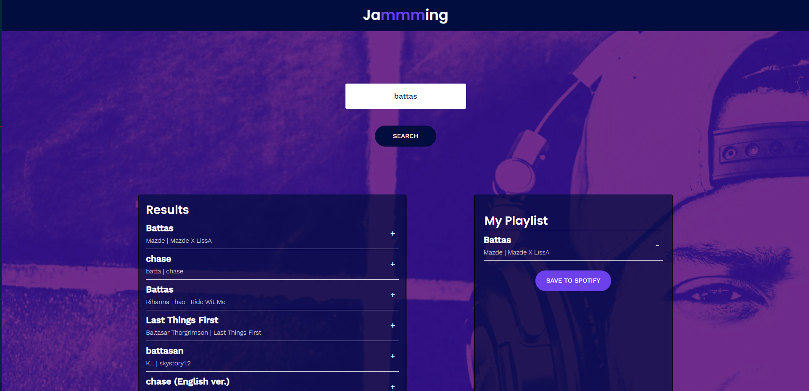

# jammming
> Spotify playlist builder

## Table of contents
* [General info](#general-info)
* [Screenshots](#screenshots)
* [Technologies](#technologies)
* [Setup](#setup)
* [Features](#features)
* [Status](#status)
* [Contact](#contact)

## General info
I was inspired to create this app as part of my full stack developer course on Codecademy.

## Screenshot

## Technologies
* Javascript
* React

## Setup
Users only need to have an active Spotify account.

## Features
Features ready:
* Search for song titles using the Spotify API.
* Add songs from the search results to a playlist.
* Change the name of the playlist.
* Save the playlist to your Spotify account.

To-do list:
* Improve the UI.
* Reload the screen with the search term once redirected from Spotify.

## Status
Project is in progress.

## Contact
Created by [@joshuakent](josh.kent94@yahoo.co.uk) - feel free to contact me!